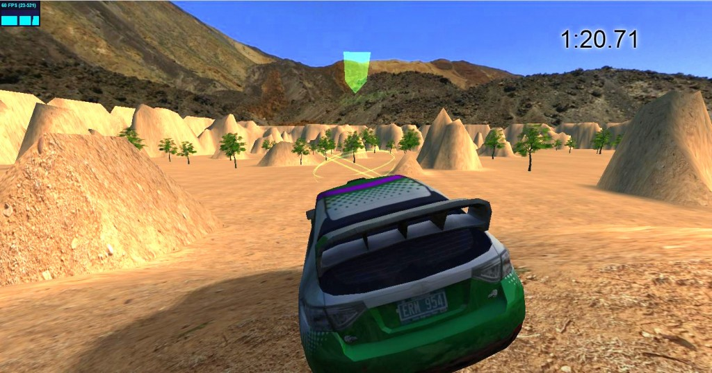

class: middle, center

# Session 1: Web Fundamentals and HTML
CodeFirst: Girls

---

# Course outline
- What we'll learn
  - **Week 1**: Web Fundamentals and HTML
  - **Week 2**: CSS
  - **Week 3**: Bootstrap
  - **Week 4**: jQuery
  - **Week 5**: Review and competition start
  - **Week 6**: Competition project final touches and presentations
- The main part of the lessons will be the worksheets and excercises. We'll be here to help!
- There will be a course social.
- Ask questions, talk to other students, and please give us feedback.

---

# Goals for today
- What is a webpage?
- HTML introduction
- HTML Demo
- **Worksheet**

---

# What is a webpage?

- A webpage is **just a document** containing
formatted text, images and links to other webpages.
The contents of a webpage and how they should appear on the screen are described in *HTML* and *CSS*.
--

  - A *client* (web browser) requests a webpage from a *server* and maybe passes along
  some extra data.
  - This is done over *HTTP* (Hypertext Transfer Protocol).
  - The server generates the page, then trasmits it back to client.
  - The client's web browser parses the HTML/CSS code to render the webpage on the screen.

- With the use of javascript, a page can interact with the user, talk with the server to get/send data, display graphics etc.
--

.centered[

]

---

class: center

# How does a webpage work?

.half-slide.lfl.centered[
**Amazon 1995**

]
--
.half-slide.rfl.centered[
**Amazon 2015**

]

---

### .left[Websites today:]

.half-slide.lfl[]
.half-slide.rfl[]
--

## .clear.center[Webpages are complete applications]
--
class: center

*Thanks to...*

# Javascript!

---

# How does a webpage work?
- **HTML**, or Hypertext Markup Language defines the contents of the page.
- **CSS**, or Cascading Style Sheet defines how these contents are displayed,
i.e. how the webpage looks.
- **Javascript** is a programming language that defines how the page behaves.
It interacts with the user, sends and receives data from a webserver,
modifies the HTML and CSS of the webpage and can even do things like 3D graphics.

.center[HTML and CSS are **.red[not]** programming languages.]

--

```html
<span class='centered'>
  HTML and CSS are <em>not</em> programming languages.
</span>
```

```css
.centered {
  text-align: center;
}

em {
  font-weight: bold;
  color: red;
}
```

---

# What is HTML?
* The standard markup language to create webpages, initially released in 1993.
* A webpage is made up of HTML tags, for example:
  * `<h1>CubeSat</h1>` - Header (title)
  * `` - an image
  * `<a href='https://cubesat.ic.ac.uk'>Imperial Cubesat</a>` - a link
  * `<p> <a href='http://google.com/'>Best search engine</a></p>` A link within a paragraph. An HTML tag can contain other HTML tags inside it, said to be its "children".
* Good HTML is **semantic** (reinforces the meaning of the information), but does not describe how the webpage will look.
---
## HTML Example

```html
  <!DOCTYPE html>
  <html>
  <head>
    <title>Example HTML Page</title>
  </head>
  <body>
    <header class='main'>
      <h1>This is an example HTML page</h1>
    </header>
    <section>
      <span class='acronym'>HTML</span> is <em>wonderful</em>.
      Here's a link to <a href='https://google.com'>google</a>
    </section>
  </body>
  </html>
```
---
# What is CSS?
* A stylesheet language introduced in 1995, used to define how
a webpage should look.
* Can be included directly in HTML `<style>` tags or referenced from an
external .css file
* Is a series of rules of the type *All header elements should be bold and red*
* More about this next time!

---

class: middle, center
# HTML Syntax Demo
[CodePen Link](http://codepen.io/dianaklee/pen/rOMzNj?editors=100)

---

class: middle, center
# Please start going through the Week 1 Worksheet

